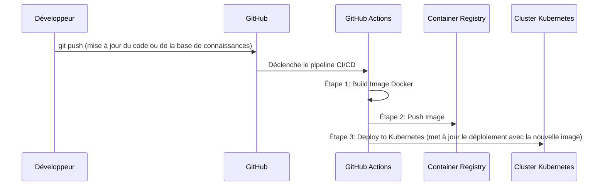

# k8s-rag-agent-gemma

[](https://opensource.org/licenses/Apache-2.0)
[](https://www.google.com/search?q=https://github.com/votre_nom/k8s-rag-agent-gemma/actions)

Un projet MLOps de référence pour déployer un agent IA spécialisé avec une architecture RAG (Retrieval-Augmented Generation), le modèle Gemma et Kubernetes. Ce dépôt sert de support technique pour la conférence "De Kubernetes à Gemma : Déployer un LLM dans un environnement Cloud Native".

## Concept : Pourquoi le RAG ?

Plutôt que de modifier le "cerveau" du modèle via un long et coûteux fine-tuning, nous utilisons une approche **RAG (Retrieval-Augmented Generation)**.

1.  **Retrieval (Récupération) :** L'agent recherche les informations les plus pertinentes dans une base de connaissances privée (des fichiers Markdown, dans notre cas).
2.  **Augmentation :** Il injecte ces informations dans le prompt du modèle Gemma.
3.  **Generation (Génération) :** Gemma utilise ce contexte pour générer une réponse précise et factuelle.

Cette méthode est flexible, facile à mettre à jour et permet une excellente traçabilité des réponses, ce qui est idéal pour les applications d'entreprise.

## Architecture MLOps

Le projet suit un workflow MLOps complet, de la modification du code au déploiement en production, entièrement automatisé.



## Structure du Dépôt

```
/k8s-rag-agent-gemma
├── .github/workflows/
│   └── cicd-pipeline.yml       # Pipeline CI/CD pour le déploiement
├── app/
│   ├── main.py                 # API (FastAPI) avec la logique RAG
│   ├── requirements.txt        # Dépendances Python de l'API
│   └── vector_db.faiss         # L'index de la base de connaissances (généré)
├── docker/
│   └── Dockerfile              # Fichier pour construire l'image de l'agent
├── knowledge_base/             # La connaissance de notre agent
│   ├── devfest.md
│   ├── communautes_google.md
│   └── services_consultant.md
├── scripts/
│   ├── build_vector_db.py      # Script pour créer la base de données vectorielle
│   └── requirements.txt        # Dépendances pour le script
├── kubernetes/
│   ├── deployment.yaml         # Manifeste de déploiement K8s
│   └── service.yaml            # Manifeste de service K8s
└── README.md
```

-----

## Guide de Démarrage

Suivez ces étapes pour déployer votre propre agent IA.

### Prérequis

  * Git
  * Python 3.9+
  * Docker Desktop ou Docker Engine
  * `kubectl` configuré pour accéder à un cluster Kubernetes

### Étape 1 : Cloner le Dépôt

```bash
git clone https://github.com/VOTRE_NOM/k8s-rag-agent-gemma.git
cd k8s-rag-agent-gemma
```

### Étape 2 : Préparer la Base de Connaissances

Ajoutez ou modifiez les fichiers Markdown dans le dossier `/knowledge_base`. Chaque fichier représente une source de savoir pour votre agent.

### Étape 3 : Créer la Base de Données Vectorielle

Ce script va lire vos documents, les convertir en vecteurs, et créer un fichier d'index que notre application pourra interroger.

```bash
# Installez les dépendances du script
pip install -r scripts/requirements.txt

# Exécutez le script d'indexation
python scripts/build_vector_db.py
```

Un fichier `vector_db.faiss` sera généré dans le dossier `/app`.

### Étape 4 : Tester l'Agent en Local avec Docker

Construisez l'image Docker. Elle va empaqueter l'API FastAPI, le modèle Gemma, et l'index de connaissances.

```bash
docker build -t rag-agent:local .
```

Lancez le conteneur. L'API sera accessible sur le port 8000.

```bash
docker run -p 8000:8000 rag-agent:local
```

Ouvrez un autre terminal et interagissez avec votre agent :

```bash
curl -X POST "http://localhost:8000/generate" \
-H "Content-Type: application/json" \
-d '{"prompt": "Quels sont les objectifs du DevFest ?"}'
```

### Étape 5 : Déployer sur Kubernetes

Appliquez les manifestes Kubernetes pour déployer votre agent sur le cluster.

```bash
kubectl apply -f kubernetes/
```

Vérifiez que les pods sont en cours d'exécution :

```bash
kubectl get pods
```

Pour tester l'agent sur le cluster, vous pouvez utiliser le port-forwarding :

```bash
kubectl port-forward service/rag-agent-service 8080:80

# Dans un autre terminal, envoyez une requête à localhost:8080
curl -X POST "http://localhost:8080/generate" \
-H "Content-Type: application/json" \
-d '{"prompt": "Parle-moi des communautés GDG en Afrique de l"Ouest"}'
```

-----

## Automatisation avec CI/CD (GitHub Actions)

Le fichier `.github/workflows/cicd-pipeline.yml` automatise les étapes 4 et 5.

**Comment ça marche ?**
À chaque `push` sur la branche `main` :

1.  **Build Job :** GitHub Actions construit l'image Docker.
2.  **Push Job :** L'image est poussée vers un Container Registry (ex: Docker Hub, GitHub Container Registry).
3.  **Deploy Job :** GitHub Actions se connecte à votre cluster Kubernetes et met à jour le déploiement avec la nouvelle image.

**Configuration :**
Pour que cela fonctionne, vous devez configurer les "Secrets" suivants dans les paramètres de votre dépôt GitHub (`Settings` \> `Secrets and variables` \> `Actions`):

  * `DOCKERHUB_USERNAME` : Votre nom d'utilisateur Docker Hub.
  * `DOCKERHUB_TOKEN` : Votre jeton d'accès Docker Hub.
  * `KUBE_CONFIG` : Le contenu de votre fichier de configuration `kubectl` (encodé en Base64).

Pour encoder votre `kubeconfig` :

```bash
cat ~/.kube/config | base64
```

## Scénario de Démonstration en Direct (Pour la Conférence)

1.  **Montrez l'état initial :** Posez une question sur un sujet qui n'est *pas* dans la `knowledge_base`. Par exemple : "Quel est le fuseau horaire d'Abidjan ?". L'agent donnera une réponse générique ou dira qu'il ne sait pas.

2.  **Ajoutez la connaissance :**

      * Montrez au public le dossier `/knowledge_base`.
      * Créez un nouveau fichier `infos_cotedivoire.md` et ajoutez-y : `Le fuseau horaire d'Abidjan est le GMT+0.`

3.  **Mettez à jour l'agent :**

      * Relancez le script d'indexation : `python scripts/build_vector_db.py`.
      * Poussez vos changements sur GitHub : `git add . && git commit -m "feat: add timezone knowledge" && git push`.

4.  **Le "Moment Magique" :**

      * Montrez le pipeline GitHub Actions qui se déclenche et déploie la nouvelle version automatiquement.
      * Une fois le déploiement terminé, posez à nouveau la même question : "Quel est le fuseau horaire d'Abidjan ?".
      * L'agent utilisera le nouveau document et donnera la réponse correcte.

Ce scénario illustre de manière puissante et concrète l'intégralité du cycle de vie MLOps et la flexibilité de l'architecture RAG.

## Licence

Ce projet est sous licence Apache 2.0. Voir le fichier `LICENSE` pour plus de détails.